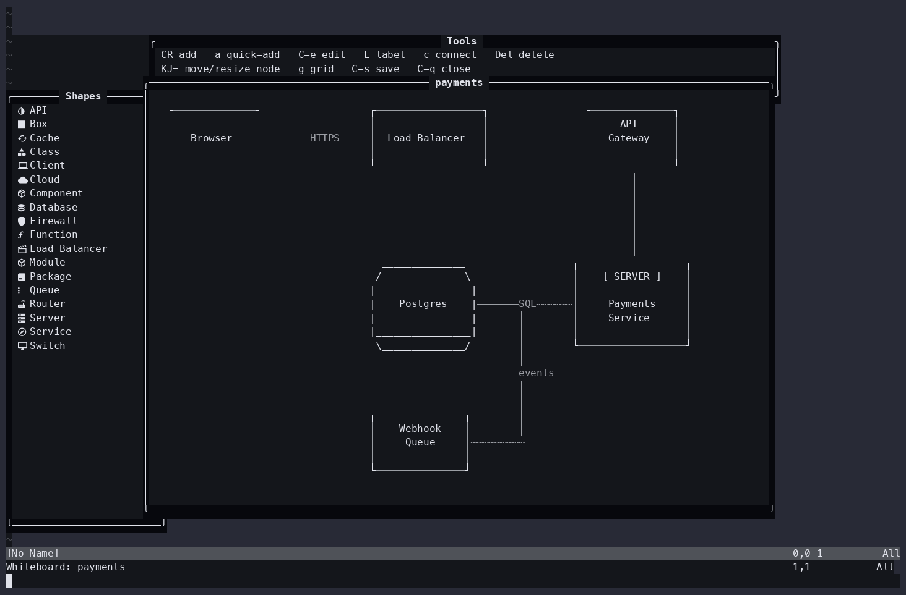
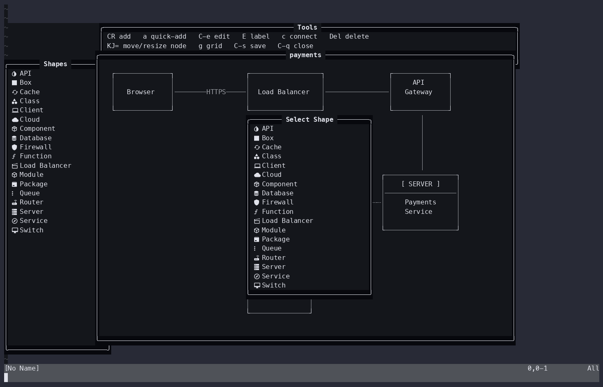

# nvim-whiteboard

Keyboard-driven diagramming inside Neovim. Sketch boxes and arrows in a floating
canvas, then export the result to ASCII, SVG, PlantUML, or Mermaid.

Built for talking through architecture while screen-sharing: the canvas is a
plain text buffer, so it renders identically for everyone watching, and the
Mermaid/PlantUML exports feed straight into downstream tooling.



## Status

Working and usable, but early. Single board at a time, no undo, no mouse. See
[Limitations](#limitations).

## Installation

### lazy.nvim

```lua
{
  'agrathwohl/nvim-whiteboard',
  config = function()
    require('whiteboard').setup()
  end,
}
```

### Packer

```lua
use {
  'agrathwohl/nvim-whiteboard',
  config = function()
    require('whiteboard').setup()
  end,
}
```

### Nix / nixvim

The flake exposes `packages.<system>.default` (a `vimPlugin`) and a
system-independent `nixvimModules.default`:

```nix
{
  inputs.nvim-whiteboard.url = "github:agrathwohl/nvim-whiteboard";

  outputs = { self, nixpkgs, nixvim, nvim-whiteboard }: {
    programs.nixvim = {
      imports = [ nvim-whiteboard.nixvimModules.default ];

      plugins.whiteboard = {
        enable = true;
        keymap = "<leader>wb";  # null to bind nothing
        settings = {
          canvas.width = 140;
        };
      };
    };
  };
}
```

## Commands

| Command                     | Description                                             |
| --------------------------- | ------------------------------------------------------- |
| `:Whiteboard [name]`        | Open a new board (defaults to `untitled`)               |
| `:WhiteboardSave [name]`    | Save the current board to `save_directory/<name>.wb`    |
| `:WhiteboardLoad {name}`    | Load a saved board (tab-completes saved names)          |
| `:WhiteboardExport {format}` | Export to `ascii`, `svg`, `plantuml`, or `mermaid`      |
| `:WhiteboardClose`          | Close the board and discard unsaved changes             |

Opening a board discards the previous one, so save first if you want to keep it.

## Keymaps

All bindings are buffer-local to the canvas and are read from `keymaps` in your
config — every entry listed below is live, and changing it changes the binding.

### Moving the cursor

| Key                    | Action                        |
| ---------------------- | ----------------------------- |
| `←` `↓` `↑` `→`, `hjkl` | Move cursor one cell          |
| `<C-arrow>`            | Move cursor five cells        |

### Nodes

| Key                        | Action                                        |
| -------------------------- | --------------------------------------------- |
| `<CR>`                     | Add node — pick a shape, then type its text   |
| `a`                        | Add node using the last shape picked          |
| `<C-e>`                    | Edit the text of the node under the cursor    |
| `E`                        | Set a label (drawn above the node)            |
| `<C-d>`                    | Duplicate the node under the cursor           |
| `<Del>`                    | Delete the node and its connections           |
| `<S-arrow>`, `HJKL`        | Move the node under the cursor                |
| `>` `<`                    | Widen / narrow the node                       |
| `=` `-`                    | Grow / shrink the node vertically             |

In the text editor popup: `<CR>` saves, `<Esc>` (or `<C-c>` in insert) cancels.

### Connections

| Key     | Action                                                     |
| ------- | ---------------------------------------------------------- |
| `c`     | Start a connection from the node under the cursor          |
| `<CR>`  | Complete the connection on the target node                 |
| `<Esc>` | Cancel                                                     |
| `E`     | Label the connection under the cursor                      |
| `D`     | Delete the connection under the cursor                     |

`E` labels whichever is under the cursor — connection first, then node.

### Canvas

| Key     | Action        |
| ------- | ------------- |
| `g`     | Toggle grid   |
| `<C-s>` | Save          |
| `<C-q>` | Close         |

## Shapes

Eighteen shape types are selectable. Three have distinct renderings —
`database`/`cache` (cylinder), `server` (titled panel), and everything else
(labelled box). The rest differ by default size and by how they map into the
PlantUML and Mermaid exports.

`box`, `database`, `cloud`, `server`, `client`, `api`, `service`, `queue`,
`cache`, `component`, `class`, `function_`, `module`, `package`, `router`,
`firewall`, `switch`, `load_balancer`



## Export

Exports are written next to your saves, named after the board.

| Format     | File   | Notes                                                          |
| ---------- | ------ | -------------------------------------------------------------- |
| `ascii`    | `.txt` | Exactly what is on screen, trailing whitespace stripped         |
| `svg`      | `.svg` | Boxes and orthogonal connectors, sized to the canvas            |
| `plantuml` | `.puml` | Shapes map to PlantUML elements (`database`, `queue`, `node`, …) |
| `mermaid`  | `.mmd` | `graph TD`, with cylinder/hexagon shapes where they apply       |

## Configuration

`setup()` is optional — the plugin loads with the defaults below. Anything you
pass is deep-merged over them.

```lua
require('whiteboard').setup({
  canvas = {
    width = 120,
    height = 40,
    grid_size = 4,      -- spacing of grid dots, in cells
    show_grid = true,
  },
  ui = {
    toolbar = { enabled = true, height = 3 },
    sidebar = { enabled = true, width = 25 },
    style = {
      border = 'rounded',
      border_highlight = 'FloatBorder',
    },
  },
  shapes = {
    default_style = { border = 'single' },  -- single|double|rounded|bold|ascii
  },
  connections = {
    default_style = 'solid',                -- solid|dashed|dotted|bold
  },
  save_directory = vim.fn.stdpath('data') .. '/whiteboard',
  export = {
    svg = { cell_width = 8, cell_height = 16, font_family = 'monospace', font_size = 14 },
    plantuml = { skinparam = true },
  },
  keymaps = {
    add_node = '<CR>',
    -- see lua/whiteboard/config.lua for the full list
  },
})
```

Two config values must not collide: if you bind the same key to two actions, the
later one silently wins.

### Highlight groups

`WhiteboardBorder`, `WhiteboardTitle`, `WhiteboardNode`, `WhiteboardConnection`,
`WhiteboardGrid`, `WhiteboardSelected` — all linked to sensible defaults.

## Limitations

- One board open at a time.
- No undo. `<Del>` and `:WhiteboardClose` are immediate.
- No mouse support; the canvas is keyboard-only.
- No node selection or multi-select — every action targets the node under the
  cursor.
- Connections route as a single orthogonal dogleg and do not avoid other nodes.
- Nodes may overlap; the higher-numbered node draws on top and takes the hit.
- `.wb` save files are JSON with a `version` field, but there is no migration
  path yet.

## License

MIT
